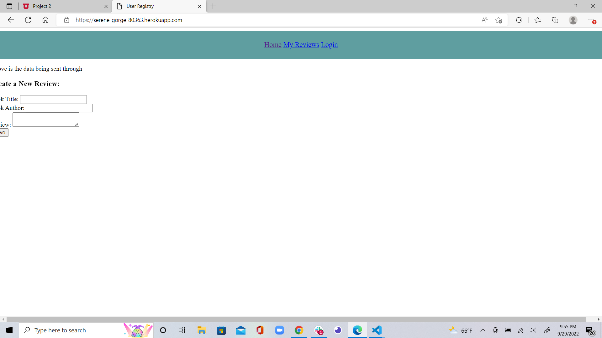

# Phil the Book Shelf 

##Book Searcher

## What is this Book Searcher?

A web service, which helps you to search for books using sorting and different filters.  If you want to see reviews or right, edit or delete on your self.  Users will need to create a login to access this site.  

## Visuals

- 

### <ins> Technologies </ins>:

- Handlebars
- Heroku
- Node.js back end
- Express.js back end
- Animate.CSS

## Resources

- [LIVE SITE](https://serene-gorge-80363.herokuapp.com/)

- [Repository](https://github.com/PhillipRose/Book-Searcher)

## Credits / Reference Material
|                                                                                               | Authors                                                  |
| -------------------------------------------------------------------------------------------------------------------------------------- | ------------------------------------------------------- |
| 1     | [Cindy Chynoweth](https://github.com/Cinderbeast)                  |
| 2     | [Phillip Rose](https://github.com/Logan2391)              |
| 3     | [Courage Cottrell](https://github.com/ccottrell52)                  |
| 4     | [Colton Vincent](https://github.com/ColtonVincent)    |
